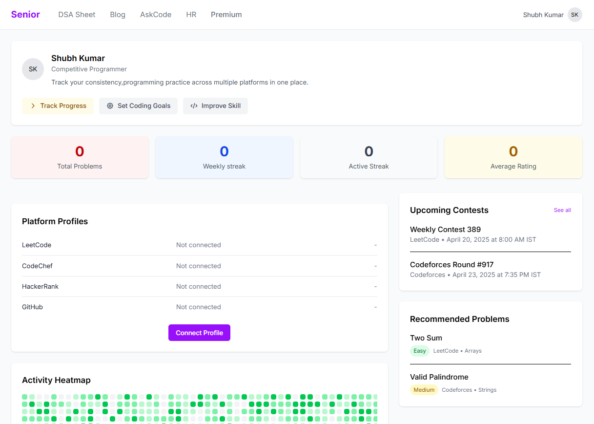

<h3 align="center">Ask Senior</h3>

<p align="center">
    The open-source link attribution platform.
    <br />
    <a href="https://demo-project-eta-five.vercel.app/"><strong>Learn more »</strong></a>
    <br />
    <br />
    <a href="#introduction"><strong>Introduction</strong></a> ·
    <a href="#tech-stack"><strong>Tech Stack</strong></a> ·
    <a href="#getting-started"><strong>Getting Started</strong></a> ·
    <a href="#project-structure"><strong>Project Structure</strong></a> ·
    <a href="#contributing"><strong>Contributing</strong></a>
</p>

<br/>

## Introduction
Set goals, track your progress, and monitor achievements. Connect with the community to collaborate and grow.


## Tech Stack

- [Next.js](https://nextjs.org/) – framework
- [TypeScript](https://www.typescriptlang.org/) – language
- [Tailwind](https://tailwindcss.com/) – CSS
- [Vercel](https://vercel.com/) – deployments

## Getting Started
Follow these steps to set up the project locally
1. Clone the repository
```
git clone https://github.com/ap-aditya/demo_project.git
```

2. Navigate to the project directory:
```
cd demo_project
```

3. Install dependencies
```
npm install
```

4. Start the development server
```
npm run dev
```

## Project Structure
```
DEMO_PROJECT/
├── .next/
├── node_modules/
├── public/
├── src/
│   ├── app/
│   ├── components/
│   │   ├── dashboard/
│   │   │   ├── ActivityHeatmap.tsx
│   │   │   ├── ContestsSection.tsx
│   │   │   ├── PlatformProfiles.tsx
│   │   │   ├── ProfileSection.tsx
│   │   │   ├── RecentSubmission.tsx
│   │   │   ├── RecommendedProblems.tsx
│   │   │   ├── SkillProgress.tsx
│   │   │   ├── StatsCards.tsx
│   │   │   └── StudyPlan.tsx
│   │   ├── layout/
│   │   │   ├── Footer.tsx
│   │   │   └── Navbar.tsx
│   ├── ui/
│   └── types/
│       └── index.ts
├── .gitignore
├── eslint.config.mjs
├── image.png
├── next-env.d.ts
├── next.config.js
├── package-lock.json
├── package.json
├── postcss.config.mjs
├── README.md
└── tsconfig.json
```


## Contributing

Contributions are welcome!  
To contribute:
1. Fork the repo
2. Create a new branch
```
git checkout -b feature/your-feature
```
3. Commit your changes
```
git commit -m 'Add your feature'
```
4. Push to the branch 
```
git push origin feature/your-feature
```
5. Open a Pull Request 